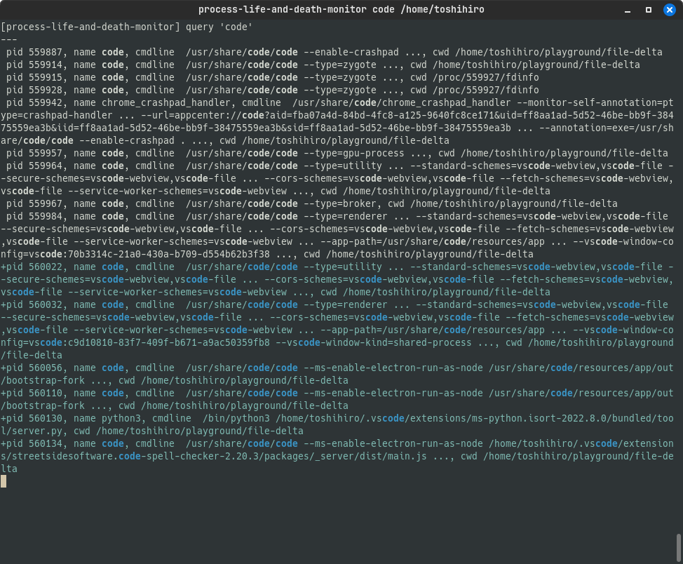
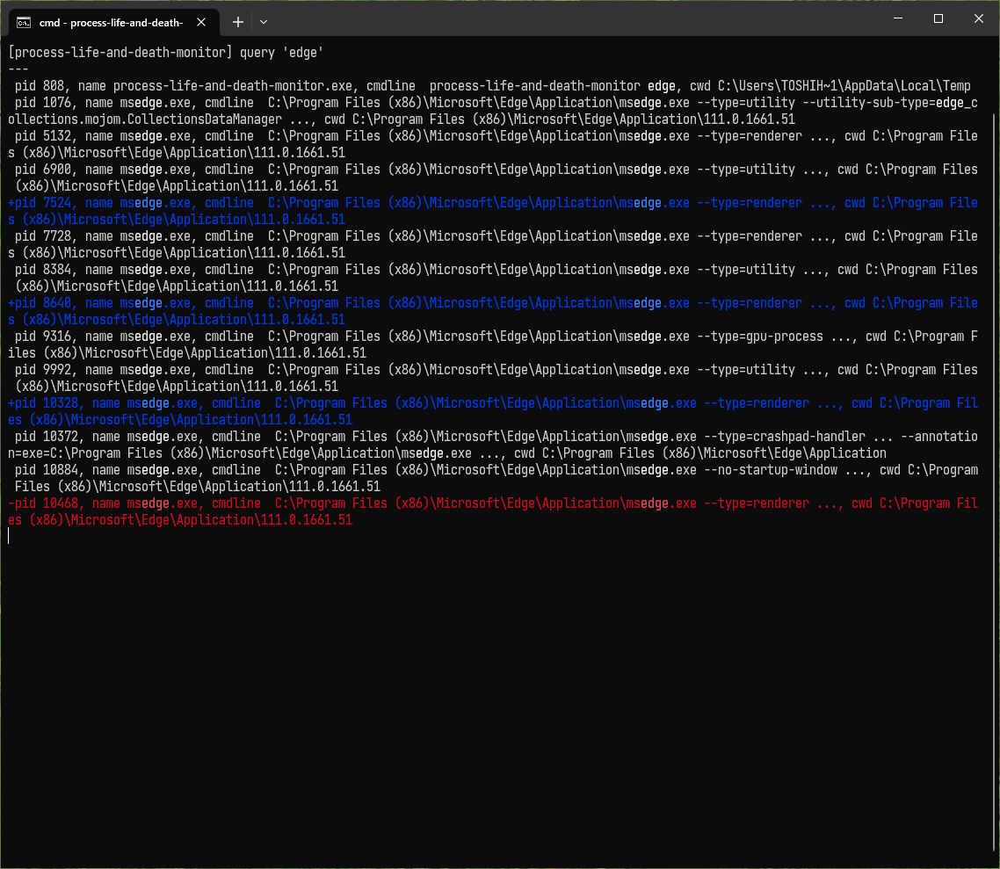

process-life-and-death-monitor
==============================

This program monitors running processes and highlights information about their creation and termination.

* Displays a list of processes that have command names or arguments or current directory that match the specified `query`.
* The display is refreshed at regular intervals,
* with newly created processes in blue and terminated processes in red.

## Installation

You can install the tool using pip:

```sh
pip install process-life-and-death-monitor
```

Or

```sh
pip install git+https://github.com/tos-kamiya/process-life-and-death-monitor
```

To uninstall:

```sh
pip uninstall process-life-and-death-monitor
```

## Usage

Run the following command to use this program.

```sh
process-life-and-death-monitor [-i INTERVAL] [-l DURATION] [-x CMDNAME]... query
```

### Command-line arguments and options

`-i --interval INTERVAL`
  set the interval between checks (in seconds), default is 0.5

`-l --highlight DURATION`
  set the duration to highlight the results (in seconds), default is 3.0

`-x --cmd-exclude CMDNAME`
  add a command name to ignore

`query`
  a pattern (regular expression) to identify processes to watch

### Examples

To monitor processes that contain the word "python", run the following command.

```sh
process-life-and-death-monitor "python"
```

To exclude processes that contain the word "grep", run the following command.

```sh
process-life-and-death-monitor -x "grep" "python"
```

### Screenshots

In gnome terminal on Linux Mint



In cmd.exe on Windows



## License

This program is licensed under the BSD 2-Clause License. See the `LICENSE` file for more information.
